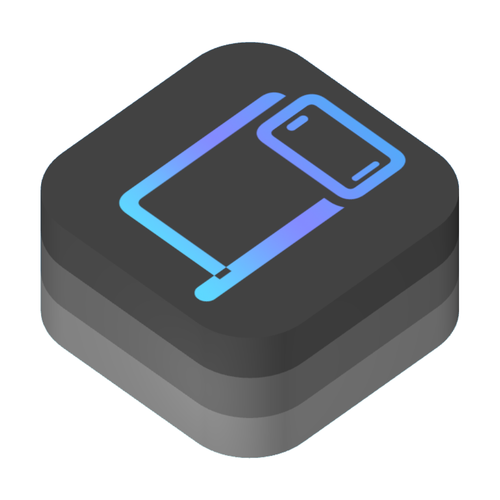

# CrossPlatform

Provides typealiases and extensions for common UI elements

## CPBezierPath

### Definition
iOS: `typealias CPBezierPath = UIBezierPath`  
macOS `typealias CPBezierPath = NSBezierPath`

### Extensions

```swift
/// Returns the path of a rounded rectangle with the specified dimensions and corner radius.
static func roundedRectangle(rect: CGRect, radius: CGFloat) -> CPBezierPath
```

## CPColor

### Definition
iOS: `typealias CPColor = UIColor`  
macOS `typealias CPColor = NSColor`

### Extensions

macOS:
```swift
/// Naming to match iOS
static var tertiaryLabel: CPColor = CPColor.tertiaryLabelColor

/// Naming to match iOS
static var systemGroupedBackground: CPColor = CPColor.windowBackgroundColor

/// Naming to match iOS
static var secondarySystemGroupedBackground: CPColor = CPColor.controlBackgroundColor
```

## CPImage

### Definition
iOS: `typealias CPImage = UIImage`  
macOS `typealias CPImage = NSImage`

### Extensions

macOS:
```swift
var cgImage: CGImage?

func pngData() -> Data?
```

SwiftUI:
```swift
Image(cpImage: CPImage)
```

## Contributing

Contributions are welcome and encouraged. Feel free to check out the project, submit issues and code patches.